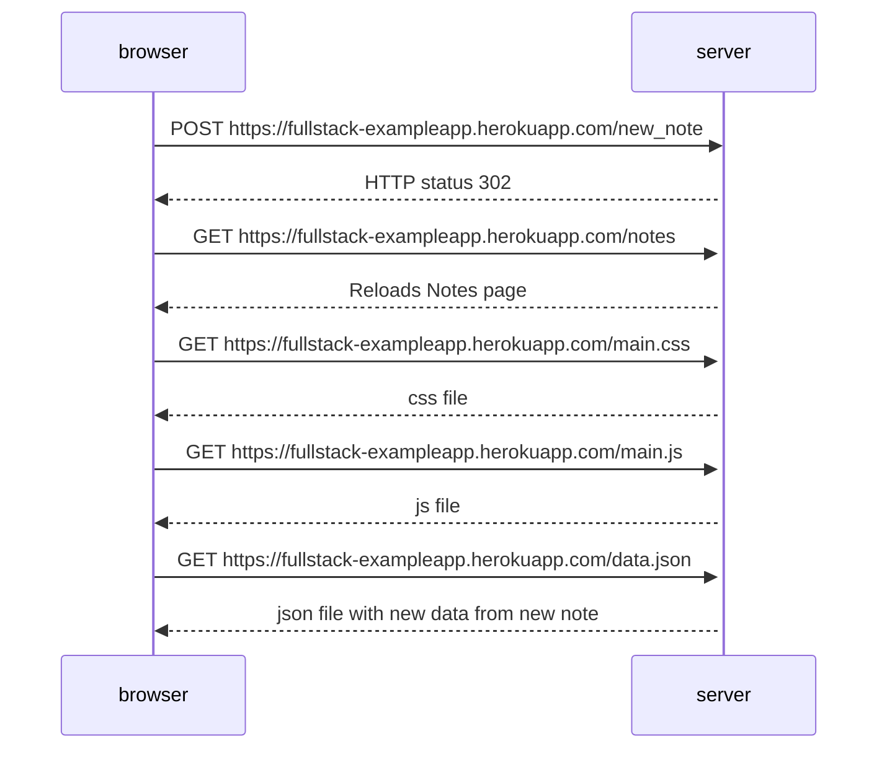

```mermaid

sequenceDiagram
    participant browser
    participant server

    browser->>server: POST https://fullstack-exampleapp.herokuapp.com/new_note
    activate server
    server-->>browser: HTTP status 302

    browser->>server: GET https://fullstack-exampleapp.herokuapp.com/notes
    activate server
    server-->>browser: Reloads Notes page

    browser->>server: GET https://fullstack-exampleapp.herokuapp.com/main.css
    activate server
    server-->>browser: css file

    browser->>server: GET https://fullstack-exampleapp.herokuapp.com/main.js
    activate server 
    server-->>browser: js file

    browser->>server: GET https://fullstack-exampleapp.herokuapp.com/data.json
    activate server
    server-->>browser: json file with new data from new note


```